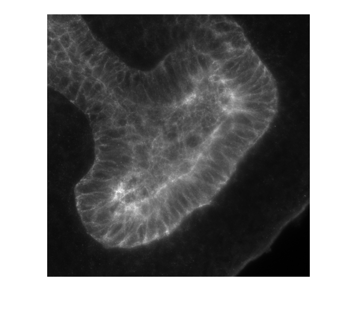

# 3D-segmentation script
First, make sure that you are in the right folder (where all your files are so that matlab can download the files in without errors.
The folder can be changed from the small arrow on the top line of this window, where your current path is  showing. 
Run each section with command shift+enter. The most common error when trying to run the first section is being in the wrong folder,
which matlab states as follows: "the file xxx does not exist".
Only change names etc. that are between these lines.       
Anything outside the lines is not needed to change, and possible errors do not come from parts outside the lines.     

**Loading the Ilastik prediction map in**
```
ilastik_filename_MEMB = 'filename.h5';
ilastik_file_MEMB = h5read(ilastik_filename_MEMB,'/exported_data/');
pred_MEMB = squeeze(ilastik_file_MEMB(2,:,:,:));
pred_MEMB = permute(pred_MEMB,[2,1,3]);
```
Let's visualize prediction map as z-projection
```
figure                                                              
imshow(sum(pred_MEMB,3),[])                                         
title('Ilastik prediction map, z-projection, membrane ch')
```


**Loading the original z-stack image in and visualize it**
```
imagename_MEMB = 'imagename.tif';
original_img_MEMB = 0*pred_MEMB;
for z = 1 : size(pred_MEMB,3) 
  temp = imread(imagename_MEMB,z);
  original_img_MEMB(:,:,z) = temp(:,:,1);
end

figure                                                              
imshow(max(original_img_MEMB,[],3),[])                             
title('max-projection, raw membrane image')                         
figure
imshow(sum(original_img_MEMB,3),[])
title('z-projection, raw membrane image')
```


Next, we create a blurred version of the membrane z-stack image and visualize it as summed z-projection. This will help to connect any gaps in the staining:
```
img_blur_MEMB = imdilate(original_img_MEMB,strel3D('sphere',3));
figure                                                              
imshow(sum(img_blur_MEMB,3),[])                                      
```


**Pixel value and size thresholding**
First, we set the pixel thresholding values. These values are pixel values between 0 and 1. To reach high accuracy in segmentation we introduce six different values in our code and later we choose the best of them. 
```
seg1_MEMB = pred_MEMB>0.5; 
seg2_MEMB = pred_MEMB>0.6;
seg3_MEMB = pred_MEMB>0.7;
seg4_MEMB = pred_MEMB>0.8;
seg5_MEMB = pred_MEMB>0.9;
seg6_MEMB = pred_MEMB>0.95;
```
In our code, we go through all these values by visualizing them one by one (code section 4.2). Here we show two examples
 of visualization
*For threshold value >0.9*
 ```
 figure                                                              
imshow(sum(single(seg5_MEMB),3),[]);                                
title('seg5 MEMB (membrane ch), ilastik prediction map th>0.9')     
```


*For threshold value >0.95*
 ```
 figure                                                              
imshow(sum(single(seg6_MEMB),3),[]);                                
title('seg6 MEMB (membrane ch), ilastik prediction map th>0.95')     
```


