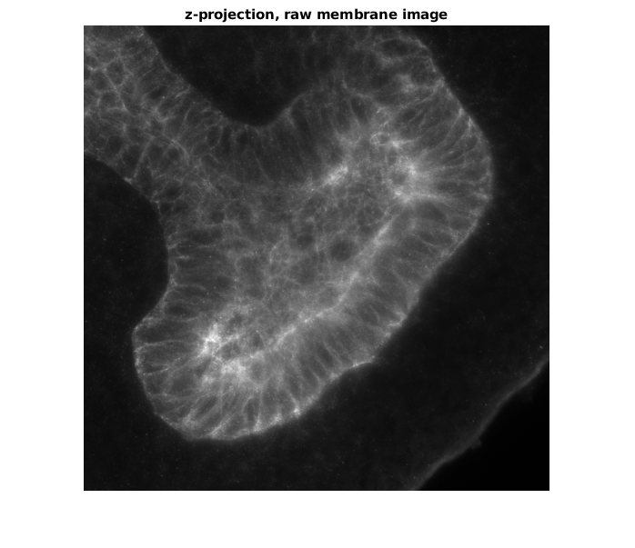
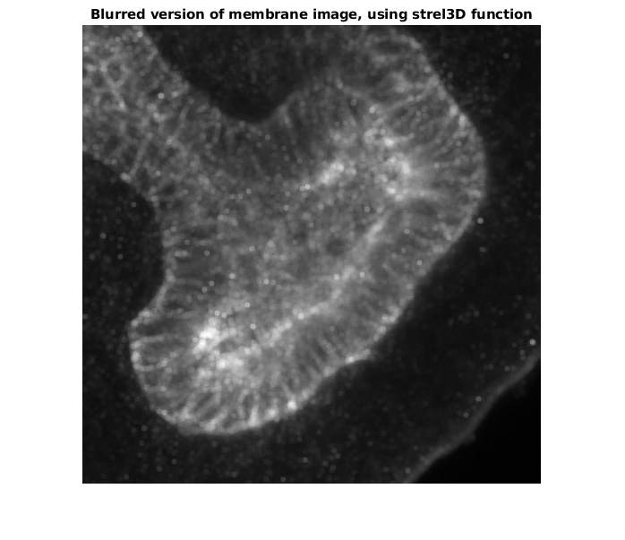
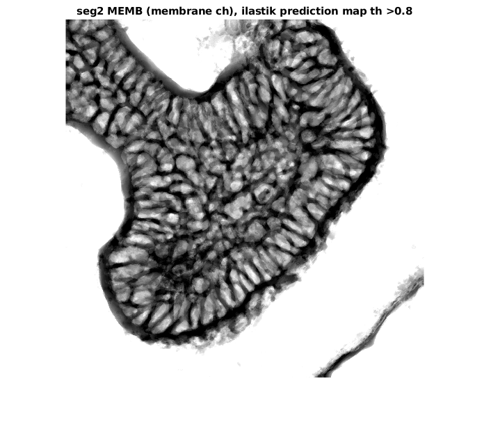
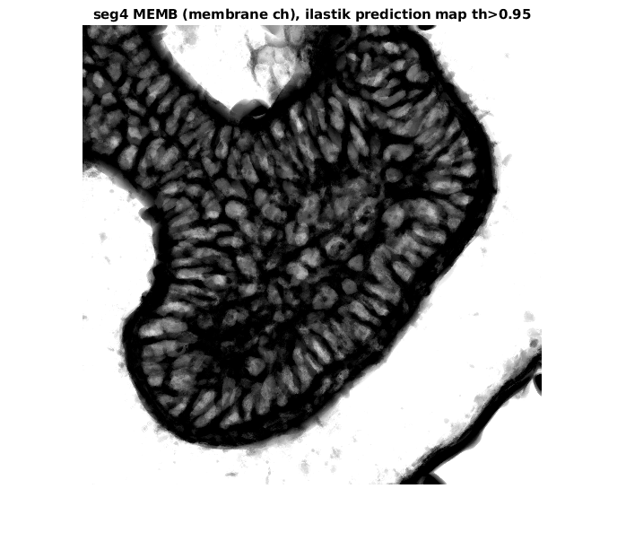
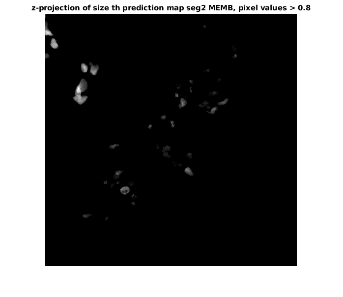
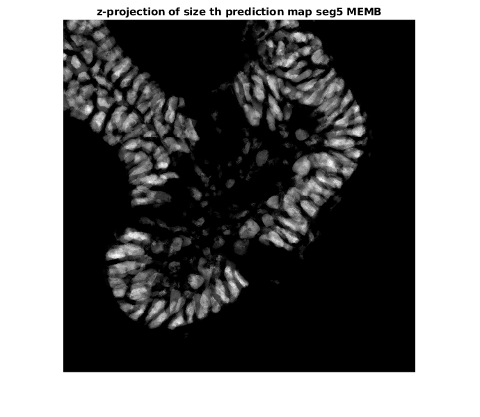
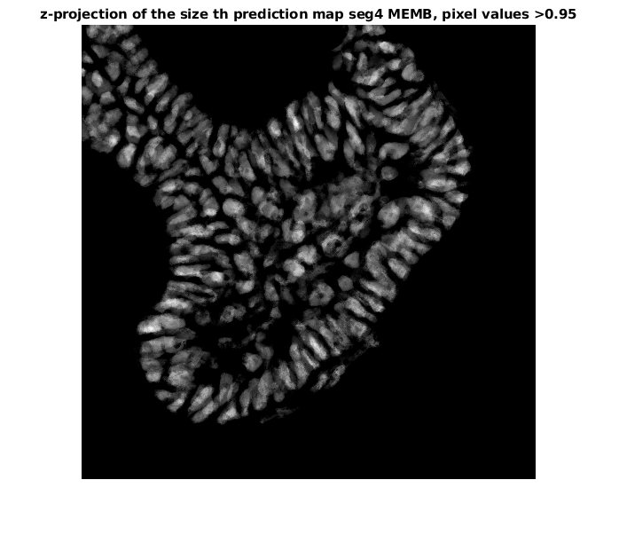
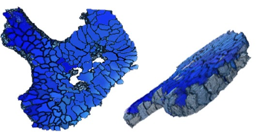
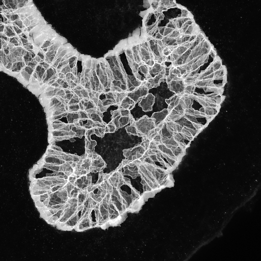

# 3D-segmentation script

- [Input data](#input-data)
- [Thresholding](#thresholding)
  - [Pixel thresholding](#pixel-value-thresholding)
  - [Size thresholding](#size-thresholding)
- [Watershed label matrix](#create-label-matrix-with-watershed)

When you open our script 3Dsegmentation_memb_final.m in matlab, make sure that you are in the right folder (where all your files are) so that matlab can download the files in without errors.
The folder can be changed from the small arrow on the top line of matlab window, where your current path is showing or by moving the script itself to the right folder.
Run each section with command shift+enter. The most common error when trying to run the first section is being in the wrong folder, which matlab states as follows: "the file xxx does not exist".
Only change filenames and follow the code comments. Aything asked to change is between lines.       
Anything outside the lines is not needed to change, and possible errors do not come from parts outside the lines.     

## Input data

**Loading the Ilastik prediction map in**

The Ilastik prediction map is .h5 format file which is exported from Ilastik machine learning program's pixel classification platform. It consists of cotinuous pixel values from 0 to 1 assigned based on the machine learning training done by user.
```
ilastik_filename_MEMB = 'filename.h5'; %write here the file name
ilastik_file_MEMB = h5read(ilastik_filename_MEMB,'/exported_data/');
pred_MEMB = squeeze(ilastik_file_MEMB(2,:,:,:));
pred_MEMB = permute(pred_MEMB,[2,1,3]);
```
Let's visualize prediction map as z-projection
```
figure                                                              
imshow(sum(pred_MEMB,3),[])                                         
title('Ilastik prediction map, z-projection, membrane ch')
```


**Loading the original z-stack image in and visualizing it**

Original z-stack image is the membrane staining image. We use the same image as an input file to both Ilastik machine learning and our Matlab script. Make sure the format is .tif
```
imagename_MEMB = 'imagename.tif';
original_img_MEMB = 0*pred_MEMB;
for z = 1 : size(pred_MEMB,3) 
  temp = imread(imagename_MEMB,z);
  original_img_MEMB(:,:,z) = temp(:,:,1);
end

figure                                                              
imshow(max(original_img_MEMB,[],3),[])                             
title('max-projection, raw membrane image')                         
figure
imshow(sum(original_img_MEMB,3),[])
title('z-projection, raw membrane image')
```


Next, we create a blurred version of the membrane z-stack image and visualize it as summed z-projection. This will help to connect any gaps in the staining:
```
img_blur_MEMB = imdilate(original_img_MEMB,strel3D('sphere',3));
figure                                                              
imshow(sum(img_blur_MEMB,3),[])   
title('Blurred version of membrane image, using strel3D function') 
```


## Thresholding 

### Pixel value thresholding

First, we set the pixel thresholding values. These values are pixel values between 0 and 1. To reach high accuracy in segmentation we introduce four different values in our code and later we choose the best of them. 
```
seg1_MEMB = pred_MEMB>0.7;
seg2_MEMB = pred_MEMB>0.8;
seg3_MEMB = pred_MEMB>0.9;
seg4_MEMB = pred_MEMB>0.95;
```
In our code, we go through all these values by visualizing them one by one (code section 4.2). Here we show two examples
 of visualization
 
*For threshold value >0.8*
 ```
 figure                                                              
imshow(sum(single(seg2_MEMB),3),[]);                                
title('seg2 MEMB (membrane ch), ilastik prediction map th>0.8')     
```


*For threshold value >0.9*
 ```
 figure                                                              
imshow(sum(single(seg3_MEMB),3),[]);                                
title('seg3 MEMB (membrane ch), ilastik prediction map th>0.9')     
```


*For threshold value >0.95*
```
figure                                                                                 
imshow(sum(single(seg4_MEMB),3),[]);                                
title('seg4 MEMB (membrane ch), ilastik prediction map th>0.95')   
```


### Size thresholding

The next step is to run the size thresholding part. In section 4.3 of the code, we use the pixel value thresholding variables and restrict the size of grouped pixels (i.e. cells and background) to extract the background leaving us with only individual cells. We do the size thresholding with same size restrictions to all pixel value thresholding variables (generated in section 4) to compare the results between pixel values and to choose the best of them. Try first with default values (min: 100 and max: 200000) and if the image shows no cells, reduce the max value by removing one zero. Run the sections 4 and 4.3 again. On contrary, if the cells are visible but so is the background, increase the max value by adding one zero and run the sections 4 and 4.3 again.

Below are visualized the same three pixel values (>0.8. >0.9, >0.95) with size thresholding:

*For threshold value >0.8*
```
seg2_MEMB = bwareaopen(seg2_MEMB,100);                               
seg2_MEMB = seg2_MEMB-bwareaopen(seg2_MEMB,200000);
figure                                                              
imshow(sum(single(seg2_MEMB),3),[]);                                
title('z-projection of size th prediction map seg2 MEMB, pixel values > 0.8')
```


*For threshold value >0.9*
```
seg3_MEMB = bwareaopen(seg3_MEMB,100);                               
seg3_MEMB = seg3_MEMB-bwareaopen(seg3_MEMB,200000);
figure                                                              
imshow(sum(single(seg3_MEMB),3),[]);                                
title('z-projection of size th prediction map seg3 MEMB, pixel values > 0.9')
```


*For threshold value >0.95*
```
seg4_MEMB = bwareaopen(seg4_MEMB,100);                               
seg4_MEMB = seg4_MEMB-bwareaopen(seg4_MEMB,200000);
figure                                                              
imshow(sum(single(seg4_MEMB),3),[]);                                
title('z-projection of size th prediction map seg4 MEMB, pixel values > 0.95')
```


Now we choose the most optimal pixel thresholding value (variables named seg1_MEMB – seg4_MEMB) based on the images on section 4.3. (exapmles visualized above). Best value gives whole individual cells without the background (example with >0.95). In most cases, values 0.8 (seg4_MEMB), 0.9 (seg5_MEMB) and 0.95 (seg4_MEMB) are the best ones.
Write the name of the value variable in between two lines in section 5 and run the section 5: Here we choose the value >0.95 i.e. the variable seg4_MEMB:
```
seg_final = seg4_MEMB;
```

## Create label matrix with watershed

**Create the seed for watershed algortihm**

In the section 6 of the script we use the blurred version of original membrane z-stack image together with the chosen pixel value thresholding to create seed for watershed algorithm. This is done by using the matlab function "imimposemin":
```
seed_MEMB = imimposemin(img_blur_MEMB,seg_final);
```
The label matrix contains information and labels of each idividual cell from the watershed segmentation. We use the machine learning segmentation tool (Ilastik) together with watershed algorithm to obtain as accurate and unbiased segmentation as possible. Below we create the label matrix and run it through the same size thresholding limits as previously with the pixel values:
```
Label_MEMB = watershed(seed_MEMB);
Label2_MEMB = bwareaopen(Label_MEMB,200);                    % min                   
Label2_MEMB = Label2_MEMB - bwareaopen(Label_MEMB,200000);   % max 
Final_Label_MEMB = bwlabeln(Label2_MEMB); 
```
To visualize the label matrix, look at the variable "Final_Label_MEMB" in Matlab app Volume viewer...



...or save the label and segmentation borders to disk and look at them in FIJI/ImageJ:
```
for z = 1 : size(Final_Label_MEMB,3)                                
    imwrite(Final_Label_MEMB(:,:,z),'Final_Label_membrane.tif','compression','none','writemode','append');
end 
for z = 1 : size(original_img_MEMB,3)                               
    temp        = zeros(size(original_img_MEMB,1),size(original_img_MEMB,2),3,'uint8');
    per         = Final_Label_MEMB(:,:,z) == 0;                             
    temp(:,:,1) = original_img_MEMB(:,:,z);      % original image on the back on red
    temp(:,:,3) = uint8(per)*100;                % Label borders on blue on top   
    imwrite(temp,'Segmentation_borders_membrane.tif','compression','none','WriteMode','append');
```



## Calculation of volumetric parameter values for each cell

Using the Matlab function "regionprops3" we extract the volumetric and spatial parameter values from the label matrix. We introduce all together 8 different parameters:
```
stats_MEMB = regionprops3(Final_Label_MEMB,'all');

CellVolumes          = stats_MEMB.Volume;                   % cell volumes
CellSurfaceAreas     = stats_MEMB.SurfaceArea;              % cell surface area
CellCentroids        = stats_MEMB.Centroid;                 % cell centroids
CellVolSurfAreaRatio = CellVolumes./CellSurfaceAreas;       % cell volume-surface area ratio
CellEllipticity      = (stats_MEMB.PrincipalAxisLength(:,1) - stats_MEMB.PrincipalAxisLength(:,3))./(stats_MEMB.PrincipalAxisLength(:,1)); % ellipticity
LongestAxis          = stats_MEMB.PrincipalAxisLength(:,1); % length of the longest axis (diameter of longest axis)
CellElongation       = LongestAxis./((stats_MEMB.PrincipalAxisLength(:,2).*stats_MEMB.PrincipalAxisLength(:,3))./2);
NumberOfCells        = size(stats_MEMB.Volume,1);           % number of cells
```
