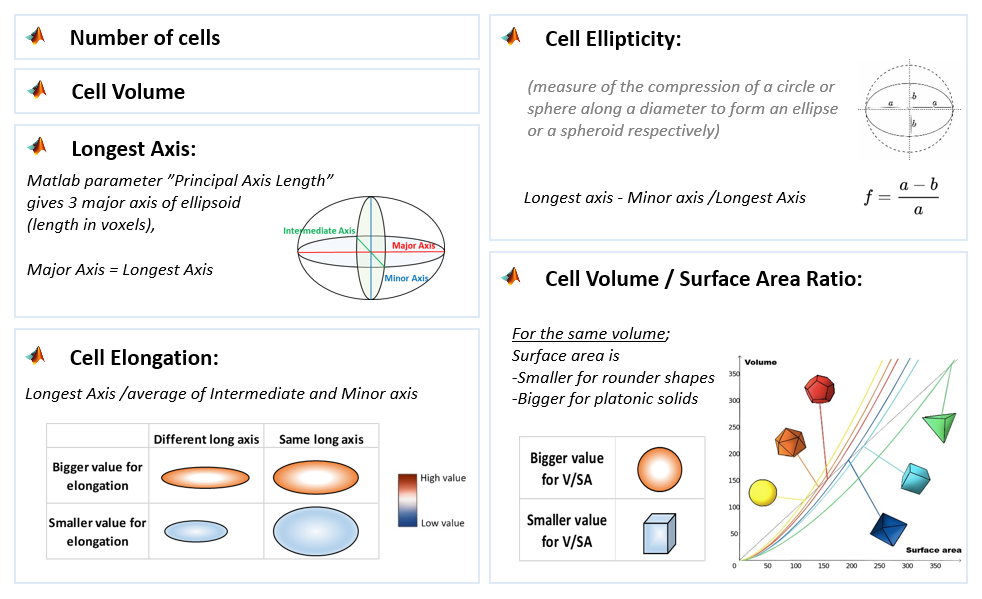
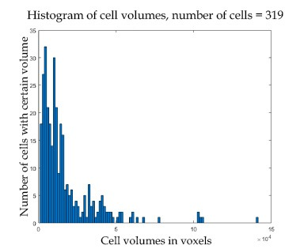
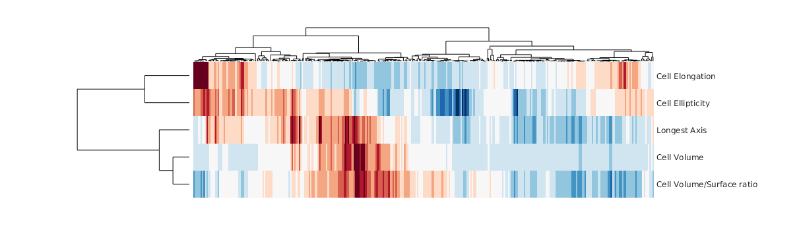
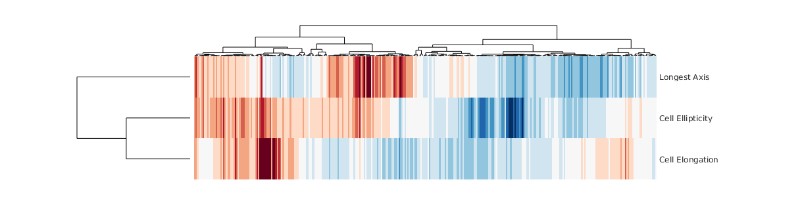
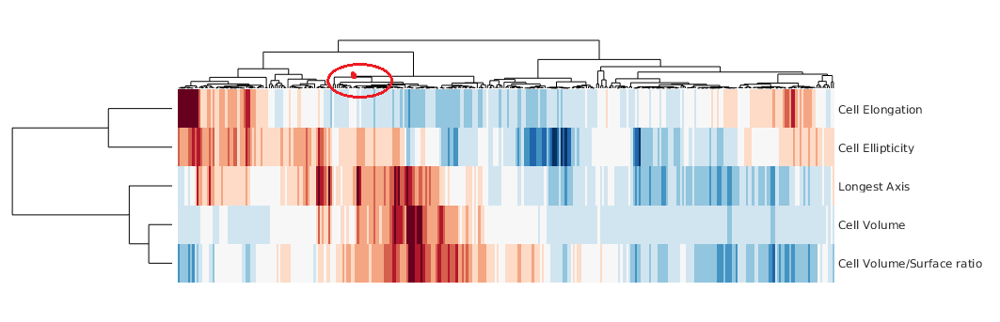
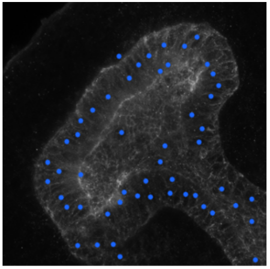
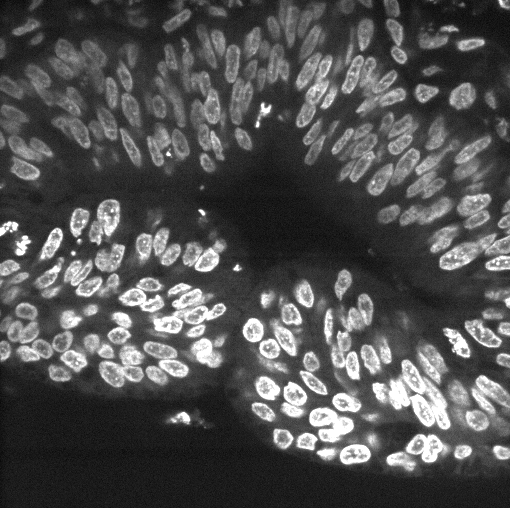
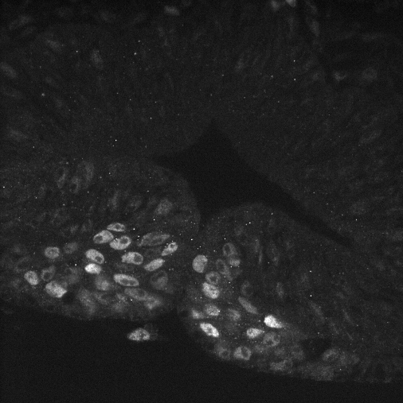
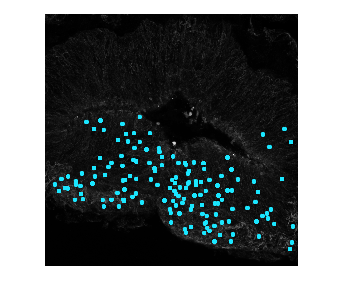
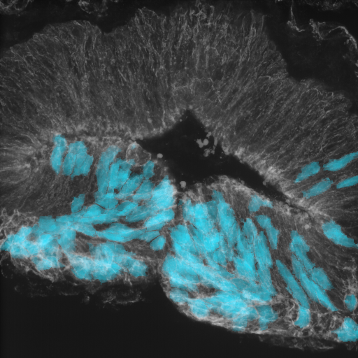

# 3D-segmentation script

- [Input data](#input-data)
- [Thresholding](#thresholding)
  - [Pixel thresholding](#pixel-value-thresholding)
  - [Size thresholding](#size-thresholding)
- [Watershed label matrix](#create-label-matrix-with-watershed)
- [Extracting spatial parameters](#extracting-spatial-and-volumetric-parameter-values-for-each-cell)
  - [Create parameter value heat maps](#create-hierarchial-clustering-heat-maps-of-the-parameter-values)
  - [Visualization](#vizualization---map-the-chosen-groups-of-cells-back-to-their-spatial-context)
- [Compare the cells with fluorescent signal location](#Compare-the-segmented-cells-with-fluorescent-signal)

When you open our script segmentation3D_script.m in matlab, make sure that you are in the right folder (where all your files are) so that matlab can download the files in without errors.
The folder can be changed from the small arrow on the top line of matlab window, where your current path is showing or by moving the script itself to the right folder.
Run each section with command shift+enter. The most common error when trying to run the first section is being in the wrong folder.
Only change filenames and follow the code comments. Aything asked to change is between lines like this:
```
%==============================================%
Here change variable names and parameters asked
%==============================================%

Here, outside the lines, don't change anything
```
Anything outside the lines is not needed to change, and possible errors do not come from parts outside the lines. Lines are only in the script file, not in this example file.    

## Input data

**Loading the Ilastik prediction map in**

The Ilastik prediction map is .h5 format file which is exported from Ilastik machine learning program's pixel classification platform. It consists of cotinuous pixel values from 0 to 1 assigned based on the machine learning training done by user.
```
ilastik_filename = 'filename.h5'; % write here the file name
ilastik_file     = h5read(ilastik_filename,'/exported_data/');
pred = squeeze(ilastik_file(2,:,:,:));
pred = permute(pred,[2,1,3]);
```
Let's visualize prediction map as z-projection
```
figure                                                              
imshow(sum(pred,3),[])                                         
title('Ilastik prediction map, z-projection, membrane ch')
```


**Loading the original z-stack image in and visualizing it**

Original z-stack image is the membrane staining image. We use the same image as an input file to both Ilastik machine learning and our Matlab script. Make sure the format is .tif
```
imagename    = 'imagename.tif';
original_img = 0*pred;
for z = 1 : size(pred,3) 
  temp = imread(imagename,z);
  original_img(:,:,z) = temp(:,:,1);
end
                    
figure
imshow(sum(original_img,3),[])
title('z-projection, raw membrane image')
```


Next, we create a blurred version of the membrane z-stack image and visualize it as summed z-projection. This will help to connect any gaps in the staining:
```
img_blur = imdilate(original_img,strel3D('sphere',3));
figure                                                              
imshow(sum(img_blur,3),[])   
title('Blurred version of membrane image, using strel3D function') 
```


## Thresholding 

### Pixel value thresholding

First, we set the pixel thresholding values. These values are pixel values between 0 and 1. To reach high accuracy in segmentation we introduce four different values in our code and later we choose the best of them. 
```
seg1 = pred>0.7;
seg2 = pred>0.8;
seg3 = pred>0.9;
seg4 = pred>0.95;
```
In our code, we go through all these values by visualizing them one by one (code section 4.2). Here we show two examples
 of visualization
 
*For threshold value >0.8*
 ```
 figure                                                              
imshow(sum(single(seg2),3),[]);                                
title('seg2 MEMB (membrane ch), ilastik prediction map th>0.8')     
```


*For threshold value >0.9*
 ```
 figure                                                              
imshow(sum(single(seg3),3),[]);                                
title('seg3 MEMB (membrane ch), ilastik prediction map th>0.9')     
```


*For threshold value >0.95*
```
figure                                                                                 
imshow(sum(single(seg4),3),[]);                                
title('seg4 MEMB (membrane ch), ilastik prediction map th>0.95')   
```


### Size thresholding

The next step is to run the size thresholding part. In section 4.3 of the code, we use the pixel value thresholding variables and restrict the size of grouped pixels (i.e. cells and background) to extract the background leaving us with only individual cells. We do the size thresholding with same size restrictions to all pixel value thresholding variables (generated in section 4) to compare the results between pixel values and to choose the best of them. Try first with default values (min: 100 and max: 15000) and if the image shows no cells, reduce the max value by removing one zero. Run the sections 4 and 4.3 again. On contrary, if the cells are visible but so is the background, increase the max value by adding one zero and run the sections 4 and 4.3 again.

Below are visualized the same three pixel values (>0.8. >0.9, >0.95) with size thresholding:

*For threshold value >0.8*
```
seg2 = bwareaopen(seg2,100);                               
seg2 = seg2-bwareaopen(seg2,200000);
figure                                                              
imshow(sum(single(seg2),3),[]);                                
title('z-projection of size th prediction map seg2, pixel values > 0.8')
```


*For threshold value >0.9*
```
seg3 = bwareaopen(seg3,100);                               
seg3 = seg3-bwareaopen(seg3,150000);
figure                                                              
imshow(sum(single(seg3),3),[]);                                
title('z-projection of size th prediction map seg3, pixel values > 0.9')
```


*For threshold value >0.95*
```
seg4 = bwareaopen(seg4,100);                               
seg4 = seg4-bwareaopen(seg4,150000);
figure                                                              
imshow(sum(single(seg4),3),[]);                                
title('z-projection of size th prediction map seg4, pixel values > 0.95')
```


Now we choose the most optimal pixel thresholding value (variables named seg1_MEMB – seg4_MEMB) based on the images on section 4.3. (exapmles visualized above). Best value gives whole individual cells without the background (example with >0.95). In most cases, values 0.8 (seg4_MEMB), 0.9 (seg5_MEMB) and 0.95 (seg4_MEMB) are the best ones.
Write the name of the value variable in between two lines in section 5 and run the section 5: Here we choose the value >0.95 i.e. the variable seg4_MEMB:
```
seg_final = seg4;
```

## Watershed label matrix

**Create the seed for watershed algortihm**

In the section 6 of the script we use the blurred version of original membrane z-stack image together with the chosen pixel value thresholding to create seed for watershed algorithm. This is done by using the matlab function "imimposemin":
```
seed = imimposemin(img_blur,seg_final);
```
The label matrix contains information and labels of each idividual cell from the watershed segmentation. We use the machine learning segmentation tool (Ilastik) together with watershed algorithm to obtain as accurate and unbiased segmentation as possible. Below we create the label matrix and run it through the same size thresholding limits as previously with the pixel values:
```
Label  = watershed(seed);
Label2 = bwareaopen(Label,100);              % min                   
Label2 = Label2 - bwareaopen(Label,15000);   % max
Final_Label_MEMB = bwlabeln(Label2); 
```
To visualize the label matrix, look at the variable "Final_Label_MEMB" in Matlab app Volume viewer...


...or save the label and segmentation borders to disk and look at them in FIJI/ImageJ:
```
for z = 1 : size(Final_Label,3)                                
    imwrite(Final_Label(:,:,z),'Final_Label_membrane.tif','compression','none','writemode','append');
end 
for z = 1 : size(original_img,3)                               
    temp        = zeros(size(original_img,1),size(original_img,2),3,'uint8');
    per         = Final_Label(:,:,z) == 0;                             
    temp(:,:,1) = original_img(:,:,z);      % original image on the back on red
    temp(:,:,3) = uint8(per)*100;           % Label borders on blue on top   
    imwrite(temp,'Segmentation_borders_membrane.tif','compression','none','WriteMode','append');
```


## Extracting spatial and volumetric parameter values for each cell

Using the Matlab function "regionprops3" we extract the volumetric and spatial parameter values from the label matrix. We introduce all together 8 different parameters:
```
stats = regionprops3(Final_Label,'all');

CellVolumes          = stats.Volume;                   % cell volumes
CellSurfaceAreas     = stats.SurfaceArea;              % cell surface area
CellCentroids        = stats.Centroid;                 % cell centroids
CellVolSurfAreaRatio = CellVolumes./CellSurfaceAreas;  % cell volume-surface area ratio
CellEllipticity      = (stats.PrincipalAxisLength(:,1) - stats.PrincipalAxisLength(:,3))./(stats.PrincipalAxisLength(:,1)); % ellipticity
LongestAxis          = stats.PrincipalAxisLength(:,1); % length of the longest axis (diameter of longest axis)
CellElongation       = LongestAxis./((stats.PrincipalAxisLength(:,2).*stats.PrincipalAxisLength(:,3))./2);
NumberOfCells        = size(stats.Volume,1);           % number of cells
```
*Description of our parameters are shown on this table:*


We check the volume distribution of the cells with histogram plot:
```
figure                                                              
hist(CellVolumes,100)
title('Cell volumes, number of cells = 319 ') % write here number of cells
ylabel('Number of Cells with certain volume')
xlabel('Cell Volume in voxels')
```


Prepare parameter matrices for clustering and heat map visualization. We can compare five of our eight parameters to each other using clustering. In section 10 of the script, we fill matrices with these parameter values and by knocking some of the parameters out one by one, we show the different combinations of these parameters:
```
% 10.1) All the parameter values
stats_matrix_all      = zeros(NumberOfCells,5);                    
stats_matrix_all(:,1) = CellVolumes;                % parameter 1: volume              
stats_matrix_all(:,2) = CellVolSurfAreaRatio;       % parameter 2: vol-surfArea ratio              
stats_matrix_all(:,3) = CellEllipticity;            % parameter 3: ellipticity          
stats_matrix_all(:,4) = CellElongation;             % parameter 4: elongation
stats_matrix_all(:,5) = LongestAxis;                % parameter 5: the length of the longest axis
zscored               = zscore(stats_matrix_MEMB_all);  

% 10.2) Knock out some parameters, six possibilities we may look:
stats_matrix_1thru2    = stats_matrix_all(:,1:2);      % parameters 1 and 2
stats_matrix_1thru3    = stats_matrix_all(:,1:3);      % parameters 1, 2 and 3   
stats_matrix_1thru4    = stats_matrix_all(:,1:4);      % parameters 1, 2, 3 and 4
stats_matrix_2thru5    = stats_matrix_all(:,2:5);      % parameters 2, 3, 4 and 5
stats_matrix_3thru5    = stats_matrix_all(:,3:5);      % parameters 3, 4 and 5
stats_matrix_4thru5    = stats_matrix_all(:,4:5);      % parameters 4 and 5
stats_matrix_1and3and4 = stats_matrix_all(:,[1,3,4]);  % parameters 1, 3 and 4
stats_matrix_1and4     = stats_matrix_all(:,[1,4]);    % parameters 1 and 4
stats_matrix_1and3     = stats_matrix_all(:,[1,3]);    % parameters 1 and 3

% 10.3) zscore all of these partial number of spatial parameters:
zscored_1thru2    = zscore(stats_matrix_1thru2); 
zscored_1thru3    = zscore(stats_matrix_1thru3);
zscored_1thru4    = zscore(stats_matrix_1thru4);
zscored_2thru5    = zscore(stats_matrix_2thru5);
zscored_3thru5    = zscore(stats_matrix_3thru5);
zscored_4thru5    = zscore(stats_matrix_4thru5);
zscored_1and3and4 = zscore(stats_matrix_1and3and4);
zscored_1and4     = zscore(stats_matrix_1and4);
zscored_1and3     = zscore(stats_matrix_1and3);
```
We save the matrices to disk so that in case we want to visualize these parameters later, we do not have to run the scrpit from the beginning:
```
save('Final_Label','Final_Label')
save('stats','stats')
save('stats_matrix_all','stats_matrix_all')
```
Create a list of parameter names for the clustergram heat maps:
```
parameters           = {'Cell Volume','Cell Volume/Surface ratio','Cell Ellipticity','Cell Elongation','Longest Axis'};
parameters_1thru2    = {'Cell Volume','Cell Volume/Surface ratio'};
parameters_1thru3    = {'Cell Volume','Cell Volume/Surface ratio','Cell Ellipticity'};
parameters_1thru4    = {'Cell Volume','Cell Volume/Surface ratio','Cell Ellipticity','Cell Elongation'};
parameters_2thru5    = {'Cell Volume/Surface ratio','Cell Ellipticity','Cell Elongation','Longest Axis'};
parameters_3thru5    = {'Cell Ellipticity','Cell Elongation','Longest Axis'};
parameters_4thru5    = {'Cell Elongation','Longest Axis'};
parameters_1and3and4 = {'Cell Volume','Cell Ellipticity','Cell Elongation'};
parameters_1and4     = {'Cell Volume','Cell Elongation'};
parameters_1and3     = {'Cell Volume','Cell Ellipticity'};
```
### Create hierarchial clustering heat maps of the parameter values

We use the matlab "clustergram" function to create hierarchial clustering heat maps for all the parameter values in each cell. Each column represents  individual cell whereas each row represents parameter value. Red indicates high value and blue low value.
Visualized here are two example heat maps (all parameters and parameters 3 through 5), yet all possible ones are in the script and come to the screen by default after running the section 12.2. The heat map branches can be assigned with color of choice manually, as demonstrated below.

```
heatm_all       = clustergram(zscored','RowLabels',parameters','ColumnPDist','cosine','RowPdist','cosine','DisplayRange',3,'Colormap',redbluecmap,'Cluster',3);
heatm_3thru5    = clustergram(zscored_3thru5','RowLabels',parameters_1thru4','ColumnPDist','cosine','RowPdist','cosine','DisplayRange',3,'Colormap',redbluecmap,'Cluster',3);
```
*all 5 parameters*



*parameters 3-5*



### Vizualization - map the chosen groups of cells back to their spatial context

In the section 12.3 in our script the code is asking the user to type in the information of the heat map branch (i.e. certain group of cells that form cluster in the heat map) that user wants to map back into original image. First, write the heat map. For example:
```
% 1. which heatmap? 
heatm_to_visualize = heatm_all;

% 2. what is the corresponding stat_matrix of this heatmap?
stats_matrix_to_visualize = stats_matrix_all;
```
Then, write the number of heat map branches that represent the groups of cells you want to map back to original image (the branch number comes visible when you click on the branch). In addition, write the name of the file that will have the groups of cells mapped back to original image. The file wil be saved as .tif z-stack to your disk. For example:

*Let's select the branch (marked with red) from this heatmap we just created*



```
% 3. which branches?
branches = [307]; 

% 4. what is going to be the name of the colored .tif image?
name = 'newgroup.tif';
```
Next, we create an empty structure which we then fill in with the information given above (sections 12.5 and 12.6):
```
xp = struct('stats_all',[],'SpatParamVals',[],'CellIdentities',[],'Centroid',[],...
    'SpatParamVals_len',[]);

xp.stats_all         = load('stats');
xp.Centroid          = xp.stats_all.stats.Centroid;
xp.SpatParamVals     = stats_matrix_to_visualize;
xp.CellIdentities    = find(xp.stats_all.stats.Volume);
xp.SpatParamVals_t   = xp.SpatParamVals';
xp.SpatParamVals_len = size(xp.SpatParamVals,1);

get(heatm_to_visualize)
```
Create a color map for the different cell groups:
```
cmp = jet(length(branches));
cmp(1,:)  = [0.1,0.4,1];   % dark blue   
cmp(2,:)  = [0.8,0.6,0.9]; % lilac
cmp(3,:)  = [0,0.8,0.8];   % cyan   
cmp(4,:)  = [0.8,0.2,0.4]; % red pink   
cmp(5,:)  = [0.9,1,0];     % yellow
cmp(6,:)  = [0.1,0.9,1];   % light blue    
cmp(7,:)  = [0.6,0.9,0.4]; % green
```
The way to access this color map is to use the following variable as an arrow that points the color user wants to start with. Default is to start with color number 1 (dark blue):
```
counter = 1;
```
The counter is a loop variable which goes through the number of branches we chose previously. Next step is to create sub cluster  and fill it with the the cells in chosen branches (structure with list "cells_of_interest" in it). In addition, we show the original image as a z-projection on the screen. This will be background for the chosen cell group's cetroid dots:
```
sub_cluster = struct('cells_of_interest',[]);
CellIdentities = cat(1,xp.CellIdentities);
range = [0;cumsum(cat(1,xp.SpatParamVals_len))];
figure
imshow(max(original_img,[],3),[]) 
hold on
```
Loop through the number of branches, filling the created structure list with each cell group's cell identities. This part also plots all the cell centroids on top of the original image open on screen, each group is colored with different color:
```
for n = branches 
        group_of_interest = clusterGroup(heatm_to_visualize, n, 'col');
        Col_Labels = group_of_interest.ColumnLabels; % here we have extracted some column labels from the clustergram
        Double_Labels = cell(0);
        for i = 1 : length(Col_Labels)
            Double_Labels{i} = str2double(Col_Labels{i});
        end
        goi = cell2mat(Double_Labels);
        cells_of_Interest = CellIdentities(goi);
        sub_cluster(counter).cells_of_interest = cells_of_Interest;
    plot(xp.stats_all.stats.Centroid(sub_cluster(counter).cells_of_interest,1),...
         xp.stats_all.stats.Centroid(sub_cluster(counter).cells_of_interest,2),'*','color',cmp(counter,:),'LineWidth',3); 
    counter = counter+1;
end
hold off
```



Next, we search these groups of cells from the original label matrix:
```
for i = 1 : length(sub_cluster)
    template = sub_cluster(i).cells_of_interest;
    for j = 1 : length(sub_cluster)
        pattern = sub_cluster(j).cells_of_interest;
        if isempty(setdiff(pattern,template)) &&(i~=j)
           sub_cluster_pruned(i).cells_of_interest = setdiff(template,pattern); 
        end
    end
    cells_of_Interest = sub_cluster_pruned(i).cells_of_interest; 
    in_group = intersect(find(cells_of_Interest>range(1)),find(cells_of_Interest<range(2)));      
    template = xp.CellIdentities; 
    pattern = cells_of_Interest(in_group);
    D = pdist2(template,pattern);
    in_xp_num = find(min(D,[],2)==0);
    id_group = xp.CellIdentities(in_xp_num);
    sub_cluster_pruned(i).cells_of_interest = id_group; 
end
```
Now, we create the final sub label which has the labels of the cells we are interested, but this time the labels are from the original label matrix. This way the spatial location of sub label cells are correct:
```
Label_sub = 0*Final_Label;   

for c = 1 : length(sub_cluster_pruned)
    cells_of_Interest = sub_cluster_pruned(c).cells_of_interest;
    for i = 1 : length(cells_of_Interest) 
        Label_sub(Final_Label == cells_of_Interest(i)) = c;
    end
end
```
Next step is to save the colored sub label to disk as .tif format z-stack. This z-stack is then interleaved with original image z-stack in FIJI/ImageJ and converted into average intensity z-projection resulting image below.
```
for z = 1 : size(Label_sub,3)
    temp  = zeros(size(Label_sub,1),size(Label_sub,2),3,'uint8');
    for c = 1 : length(sub_cluster_pruned)
        tmp = Label_sub(:,:,z);
        tmp(tmp~=c) = 0;
        tmp = tmp>0;
        temp(:,:,1) = uint8(cmp(c,1).*255*double(tmp))+temp(:,:,1);
        temp(:,:,2) = uint8(cmp(c,2).*255*double(tmp))+temp(:,:,2);
        temp(:,:,3) = uint8(cmp(c,3).*255*double(tmp))+temp(:,:,3);
    end
    imwrite(temp,name,'tiff','Compression','none','WriteMode','append');
end
```


# Compare the segmented cells with fluorescent signal

In addition, we can use this code to compare the cell segmentation with nuclear staining or fluorescent signal segmentation results. To do so, one must first run the segmentation part of our pipeline for the desired fluorescent signal files. After doing so, drag the resulting "stats" -files to your MATLAB workspace. In our code, we provide the possibility of comparing the cell segmentation to two different staining signals. These are marked as "fluor1" and "fluor2". Exapmles of such comparable staining is for example DAPI, which results just normal nucleus segmentation. The other possibility is to use specific fluorescent staining. 

First, we allocate matrix where the cell label numbers will be saved together with "true" and "false" values for whether the certain cell has either or both of the fluorescent signals. We then loop through the number of cells and for each cell, we go through the voxel list of that cell and compare it to the centroid array of each fluorescent signal label. If the centroid of the fluorescent signal is found inside the cell's voxel list, we get positive signal, and the boolean value "true", i.e. value 1 will be located into the comparison matrix. Otherwise the matrix has value of "false", i.e. 0.

```
comparison_matrix  = zeros(size(stats,1),5);
Npositives_fluor1  = 0;
Npositives_fluor2  = 0; 
centroid_fluor1    = zeros(1,3);
centroid_fluor2    = zeros(1,3);

for N = 1:size(stats,1)

    voxelList = stats.VoxelList(N,:);
    voxelList = voxelList{:,:};
    
    comparison_matrix(N,1) = N; % cell label
    for n = 1:size(stats_fluor1,1)  % fluor1 signal
        centroid_fluor1 = round(stats_fluor1.Centroid(n,:)); 
        if ismember(centroid_fluor1,voxelList,'rows')==1
            comparison_matrix(N,2) = n; % since we have signal, write down the dapi signal label
            comparison_matrix(N,3) = 1; % yes, we have fluor1 signal in cell N.  ( 1 = positive, 0 = negative )
            Npositives_fluor1 = Npositives_fluor1 +1;
        end
    end
    for h = 1:size(stats_fluor2,1) % the other fluorescent signal
        centroid_fluor2 = round(stats_fluor2.Centroid(h,:));
        if ismember(centroid_fluor2,voxelList,'rows')==1
            comparison_matrix(N,4) = h; % since we have signal, write down the fluor label number
            comparison_matrix(N,5) = 1; % yes, we have fluor signal.( 1 = positive, 0 = negative )
            Npositives_fluor2 = Npositives_fluor2 + 1;
        end
    end
  
end
```
For example, we used this image as our membrane staining:


And this image as the first fluorescent signal staining:



And this image as the second fluorescent signal staining:



And after running all three of them individually though the segmentation, we obtained the "stats" files, and were able to run the comparison.

Now we have obtained the number of positive cells for both fluorescent signals. "Npositives_fluor1" tells the number of cells with fluorescent1 signal. Analogically, "Npositives_fluor2" tells the number of cells with fluorescent2 signal. In addition to the number of these cells, the identification numbers of those cells are saved in the comparison matrix together with the identification / label numbers of positive signals.

Next, we want to visualize the cells that have positive signal in both fluorescent stainings, i.e. the cells that contain both fluorescent stainings. First, we pre-allocate and again choose the colour (counter):

```
positives = struct('positive_stats',[],'CellIdentities',[],'Centroid',[]);
positives.positive_stats = load('stats'); % stats of cells, make sure you are in the right folder
positives.Centroid       = positives.positive_stats.stats.Centroid;
positives.CellIdentities = find(positives.positive_stats.stats.Volume);

counter = 1; % for the color
```
Then, we visualize the centroids on top of the original membrane staining image:

```
sub_cluster = struct('cells_of_interest',[]);
CellIdentities = cat(1,positives.CellIdentities);

figure
imshow(max(original_img,[],3),[]) 
hold on
for i = 1:size(comparison_matrix,1)
    if (comparison_matrix(i,5) == 1)
        cells_of_Interest(i,1) = i;
    end
end
cells_of_Interest(cells_of_Interest == 0) = []; %remove the xeroes
sub_cluster(counter).cells_of_interest = cells_of_Interest;
plot(positives.Centroid(sub_cluster(counter).cells_of_interest,1),...
         positives.Centroid(sub_cluster(counter).cells_of_interest,2),'*','color',cmp(counter,:),'LineWidth',3); 
hold off

```
For our example images, the resulting centroid image looks as follows:



Finally, we create the sub-label matrix based on the cell identification numbers that have double positive values (positive for both fluorescent signals) and save this as .tiff to the disk. Remember to change the name (between the lies below):

```
sub_cluster_pruned = sub_cluster;
for i = 1 : length(sub_cluster)
    template = sub_cluster(i).cells_of_interest;
    for j = 1 : length(sub_cluster)
        pattern = sub_cluster(j).cells_of_interest;
        if isempty(setdiff(pattern,template)) &&(i~=j)
           sub_cluster_pruned(i).cells_of_interest = setdiff(template,pattern); 
        end
    end
    cells_of_Interest = sub_cluster_pruned(i).cells_of_interest; 
    %in_group = intersect(find(cells_of_Interest>range(1)),find(cells_of_Interest<range(2)));      
    template = positives.CellIdentities; 
    D = pdist2(template,cells_of_Interest);
    in_positives_num = find(min(D,[],2)==0);
    id_group = positives.CellIdentities(in_positives_num);
    sub_cluster_pruned(i).cells_of_interest = id_group; 
end
Label_sub = 0*Final_Label;  

for c = 1 : length(sub_cluster_pruned)
    cells_of_Interest = sub_cluster_pruned(c).cells_of_interest;
    for i = 1 : length(cells_of_Interest) 
        Label_sub(Final_Label == cells_of_Interest(i)) = c;
    end
end

for z = 1 : size(Label_sub,3)
    temp  = zeros(size(Label_sub,1),size(Label_sub,2),3,'uint8');
    for c = 1 : length(sub_cluster_pruned)
        tmp = Label_sub(:,:,z);
        tmp(tmp~=c) = 0;
        tmp = tmp>0;
        temp(:,:,1) = uint8(cmp(c,1).*255*double(tmp))+temp(:,:,1);
        temp(:,:,2) = uint8(cmp(c,2).*255*double(tmp))+temp(:,:,2);
        temp(:,:,3) = uint8(cmp(c,3).*255*double(tmp))+temp(:,:,3);
    end
    %=========================================================================%
    name = 'double-positives';
    %=========================================================================%
    imwrite(temp,name,'tiff','Compression','none','WriteMode','append');
end

```
When this sub-label .tiff is combined with the original membrane staining image in FIJI/ImageJ and viewed as z-projection, we get the following result for our positive fluorescent signal cell group:



